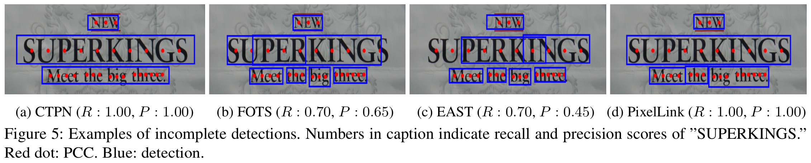
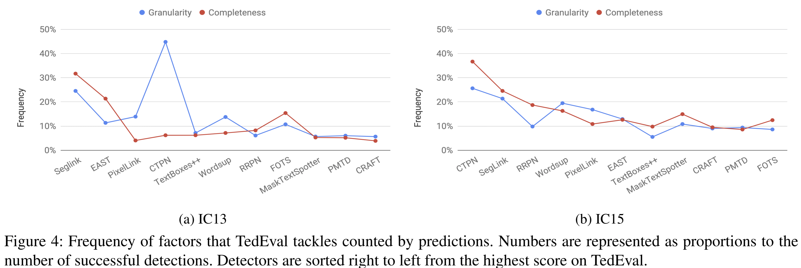
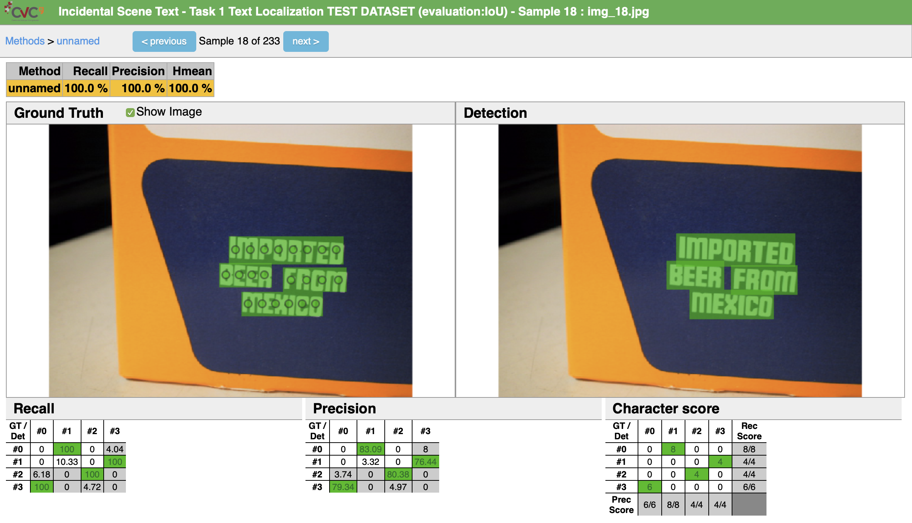

# TedEval: A Fair Evaluation Metric for Scene Text Detectors

Official Python 3 implementation of TedEval | [paper](https://arxiv.org/abs/1907.01227) | [slides](https://docs.google.com/presentation/d/1EFK_WjpdLExZVDPt4C7yCcxjpXNvIyAOL9zUnKx1VoY/edit?usp=sharing)

**[Chae Young Lee](mailto:cylee7133@gmail.com), Youngmin Baek, and Hwalsuk Lee.**

Clova AI Research, NAVER Corp.

### Overview

We propose a new evaluation metric for scene text detectors called TedEval. Through separate instance-level matching policy and character-level scoring policy, TedEval solves the drawbacks of previous metrics such as IoU and DetEval. This code is based on [ICDAR15 official evaluation code](http://rrc.cvc.uab.es/).

## Methodology

### 1. Mathcing Policy

- Non-exclusively gathers all possible matches of not only one-to-one but also one-to-many and many-to-one.
- The threshold of both area recall and area precision are set to 0.4.
- Multiline is identified and rejected when _|min(theta, 180 - theta)| > 45_ from Fig. 2.

<p align="center">

### 2. Scoring Policy

We compute Pseudo Character Center (PCC) from word-level bounding boxes and penalize matches when PCCs are missing or overlapping.

<p align="center">

### Sample Evaluation



## Experiments

We evaluated state-of-the-art scene text detectors with TedEval on two benchmark datasets: ICDAR 2013 Focused Scene Text (IC13) and ICDAR 2015 Incidental Scene Text (IC15). Detectors are listed in the order of published dates.

### ICDAR 2013

|                        Detector                         | Date (YY/MM/DD) | Recall (%) | Precision (%) | H-mean (%) |
| :-----------------------------------------------------: | :-------------: | :--------: | :-----------: | :--------: |
|      [CTPN](https://arxiv.org/pdf/1609.03605.pdf)       |    16/09/12     |    82.1    |     92.7      |    87.6    |
|      [RRPN](https://arxiv.org/pdf/1703.01086.pdf)       |    17/03/03     |    89.0    |     94.2      |    91.6    |
|     [SegLink](https://arxiv.org/pdf/1703.06520.pdf)     |    17/03/19     |    65.6    |     74.9      |    70.0    |
|      [EAST](https://arxiv.org/pdf/1704.03155.pdf)       |    17/04/11     |    77.7    |     87.1      |    82.5    |
|       [WordSup](https://arxiv.org/pdf/1708.06720)       |    17/08/22     |    87.5    |     92.2      |    90.2    |
|    [PixelLink](https://arxiv.org/pdf/1801.01315.pdf)    |    18/01/04     |    84.0    |     87.2      |    86.1    |
|      [FOTS](https://arxiv.org/pdf/1801.01671.pdf)       |    18/01/05     |    91.5    |     93.0      |    92.6    |
|   [TextBoxes++](https://arxiv.org/pdf/1801.02765.pdf)   |    18/01/09     |    87.4    |     92.3      |    90.0    |
| [MaskTextSpotter](https://arxiv.org/pdf/1807.02242.pdf) |    18/07/06     |    90.2    |     95.4      |    92.9    |
|      [PMTD](https://arxiv.org/pdf/1903.11800.pdf)       |    19/03/28     |    94.0    |     95.2      |    94.7    |
|      [CRAFT](https://arxiv.org/pdf/1904.01941.pdf)      |    19/04/03     |    93.6    |     96.5      |    95.1    |

### ICDAR 2015

|                        Detector                         | Date (YY/MM/DD) | Recall (%) | Precision (%) | H-mean (%) |
| :-----------------------------------------------------: | :-------------: | :--------: | :-----------: | :--------: |
|      [CTPN](https://arxiv.org/pdf/1609.03605.pdf)       |    16/09/12     |    85.0    |     81.1      |    67.8    |
|      [RRPN](https://arxiv.org/pdf/1703.01086.pdf)       |    17/03/03     |    79.5    |     85.9      |    82.6    |
|     [SegLink](https://arxiv.org/pdf/1703.06520.pdf)     |    17/03/19     |    77.1    |     83.9      |    80.6    |
|      [EAST](https://arxiv.org/pdf/1704.03155.pdf)       |    17/04/11     |    82.5    |     90.0      |    86.3    |
|       [WordSup](https://arxiv.org/pdf/1708.06720)       |    17/08/22     |    83.2    |     87.1      |    85.2    |
|    [PixelLink](https://arxiv.org/pdf/1801.01315.pdf)    |    18/01/04     |    85.7    |     86.1      |    86.0    |
|      [FOTS](https://arxiv.org/pdf/1801.01671.pdf)       |    18/01/05     |    89.0    |     93.4      |    91.2    |
|   [TextBoxes++](https://arxiv.org/pdf/1801.02765.pdf)   |    18/01/09     |    82.4    |     90.8      |    86.5    |
| [MaskTextSpotter](https://arxiv.org/pdf/1807.02242.pdf) |    18/07/06     |    82.5    |     91.8      |    86.9    |
|      [PMTD](https://arxiv.org/pdf/1903.11800.pdf)       |    19/03/28     |    89.2    |     92.8      |    91.0    |
|      [CRAFT](https://arxiv.org/pdf/1904.01941.pdf)      |    19/04/03     |    88.5    |     93.1      |    90.9    |

### Frequency



## Getting Started

### Clone repository

`git clone https://github.com/clovaai/TedEval.git`

### Requirements

- python 3
- python 3.x Polygon, Bottle, Pillow

```python3
# install
pip3 install Polygon3 bottle Pillow
```

### Supported Annotation Type

- LTRB (xmin, ymin, xmax, ymax)
- QUAD (x1, y1, x2, y2, x3, y3, x4, y4)

## Evaluation

### Prepare data

The ground truth and the result data should be text files, one for each sample. Note that the naming rule of each text file is that there must be `img_{number}` in the filename and that the number indicate the image sample.

```
# gt/gt_img_38.txt
644,101,932,113,932,168,643,156,concierge@L3
477,138,487,139,488,149,477,148,###
344,131,398,130,398,149,344,149,###
1195,148,1277,138,1277,177,1194,187,###
23,270,128,267,128,282,23,284,###

# result/res_img_38.txt
644,101,932,113,932,168,643,156,{Transcription},{Confidence}
477,138,487,139,488,149,477,148
344,131,398,130,398,149,344,149
1195,148,1277,138,1277,177,1194,187
23,270,128,267,128,282,23,284
```

Compress these text files without the parent directory.

```python3
zip gt.zip gt/*
zip result.zip result/*
```

Refer to `gt/result.zip` and `gt/gt_*.zip` for examples.

### Run stand-alone evaluation

```python3
python script.py –g=gt/gt.zip –s=result/result.zip
```

For evaluation setup, please refer to the following parameter list to edit `default_evaluation_params()` in `script.py`.

### Important Parameters

<!--
### Paramters for evaluation script
| name | type | default | description |
| ---- | ---- | ------- | ---- |
| -g | ```string``` | | path to ground truth zip file |
| -s | ```string``` | | path to result zip file |
| -o | ```string``` | | path to save per-sample result file 'results.zip' | -->

| name                      | type      | default | description                                                   |
| ------------------------- | --------- | ------- | ------------------------------------------------------------- |
| AREA_RECALL_CONSTRAINT    | `float`   | `0.4`   | area recall constraint (0 <= R <= 1)                          |
| AREA_PRECISION_CONSTRAINT | `float`   | `0.4`   | area precision constraint (0 <= P <= 1)                       |
| GT_LTRB                   | `boolean` | `False` | GT file annotation type (True if LTRB, False if QUAD)         |
| DET_LTRB                  | `boolean` | `False` | prediction file annotation type (True if LTRB, False if QUAD) |
| TRANSCRIPTION             | `boolean` | `False` | set True if result file has transcription                     |
| CONFIDENCES               | `boolean` | `False` | set True if result file has confidence                        |

- Note : Please refer to `arg_parser.py` file for additional parameters and default settings used internally.

### Run Visualizer

```python3
python web.py
```

- Place the zip file of images and GTs of the dataset named `images.zip` and `gt.zip`, respectively, in the `gt` directory.
- Create an empty directory name `output`. This is where the DB, submission files, and result files will be created.
- You can change the host and port number in the final line of `web.py`.

The file structure should then be:

```
.
├── gt
│   ├── gt.zip
│   └── images.zip
├── output   # empty dir
├── script.py
├── web.py
├── README.md
└── ...
```



## Citation

```
@article{lee2019tedeval,
  title={TedEval: A Fair Evaluation Metric for Scene Text Detectors},
  author={Lee, Chae Young and Baek, Youngmin and Lee, Hwalsuk},
  journal={arXiv preprint arXiv:1907.01227},
  year={2019}
}
```

## Contact us

We welcome any feedbacks to our metric. Please contact the authors via `{cylee7133, youngmin.baek, hwalsuk.lee}@gmail.com`. In case of code errors, open an issue and we will get to you.

## License

```
Copyright (c) 2019-present NAVER Corp.

 Permission is hereby granted, free of charge, to any person obtaining a copy
of this software and associated documentation files (the "Software"), to deal
in the Software without restriction, including without limitation the rights
to use, copy, modify, merge, publish, distribute, sublicense, and/or sell
copies of the Software, and to permit persons to whom the Software is
furnished to do so, subject to the following conditions:

 The above copyright notice and this permission notice shall be included in
all copies or substantial portions of the Software.

 THE SOFTWARE IS PROVIDED "AS IS", WITHOUT WARRANTY OF ANY KIND, EXPRESS OR
IMPLIED, INCLUDING BUT NOT LIMITED TO THE WARRANTIES OF MERCHANTABILITY,
FITNESS FOR A PARTICULAR PURPOSE AND NONINFRINGEMENT.  IN NO EVENT SHALL THE
AUTHORS OR COPYRIGHT HOLDERS BE LIABLE FOR ANY CLAIM, DAMAGES OR OTHER
LIABILITY, WHETHER IN AN ACTION OF CONTRACT, TORT OR OTHERWISE, ARISING FROM,
OUT OF OR IN CONNECTION WITH THE SOFTWARE OR THE USE OR OTHER DEALINGS IN
THE SOFTWARE.
```
